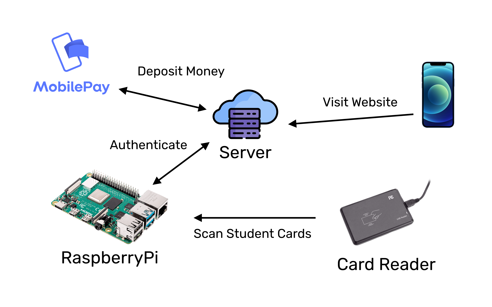

# IMADA Pay

IMADA Pay er et initiativ til at lave et betalingssystem for drikkevarene man kan købe i saunaen.
Målet med projektet er først og fremmest at bygge det i åbenhed sådan at alle er velkomne til at hjælpe med,
om man er førsteårsstuderende og lige har lært at programmere lidt og gerne vil lære mere,
eller man har en lang programmeringsbaggrund og har lyst til at give noget viden videre.

## Hvordan det skal virke

Tanken er at når man gerne vil købe en sodavand eller øl,
skal man kunne scanne sit studiekort på en scanner på siden af køleskabet,
derefter vil man høre et bip som betyder at den er betalt.

På samme måde som rejsekort, skal man kunne tanke sit kort op ved at sende penge med Mobilepay.
Først når man har lagt penge på sit kort kan man bruge det til at købe drikkevare med.

